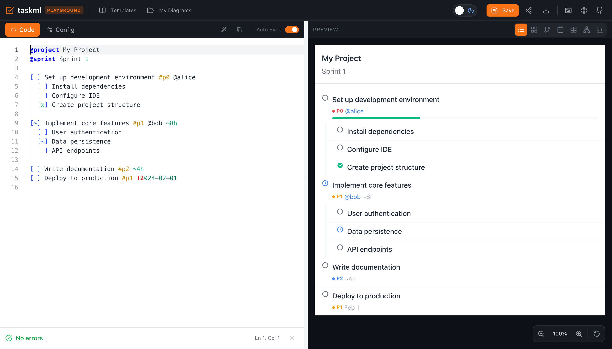
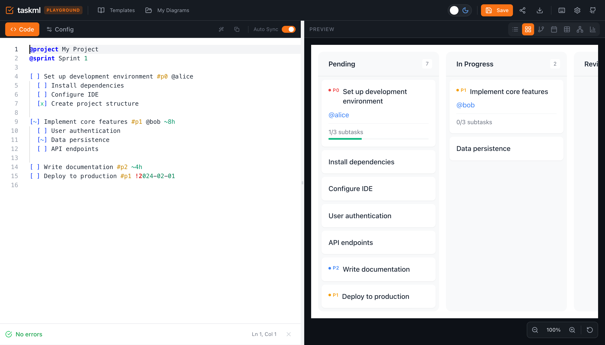
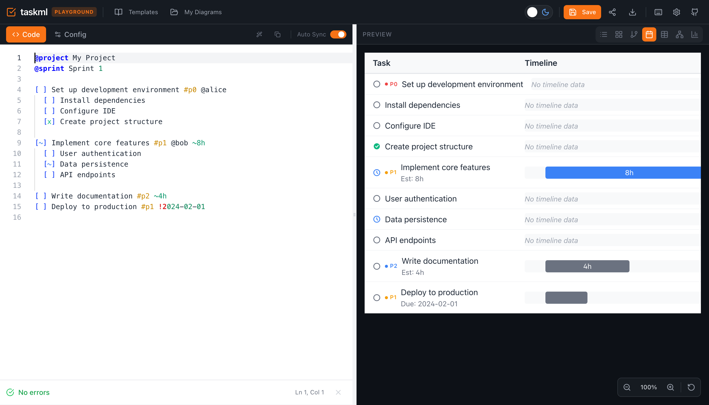
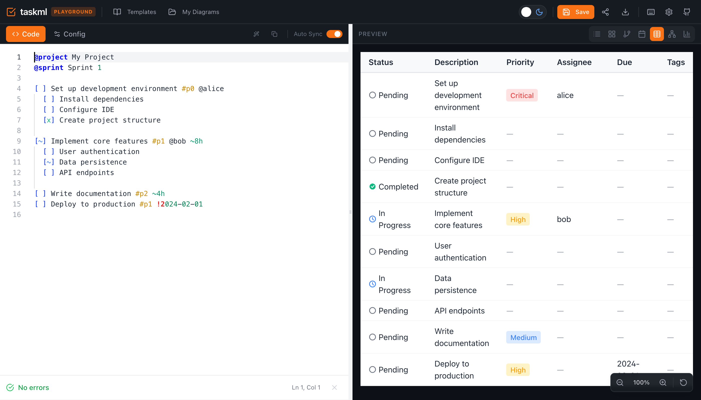
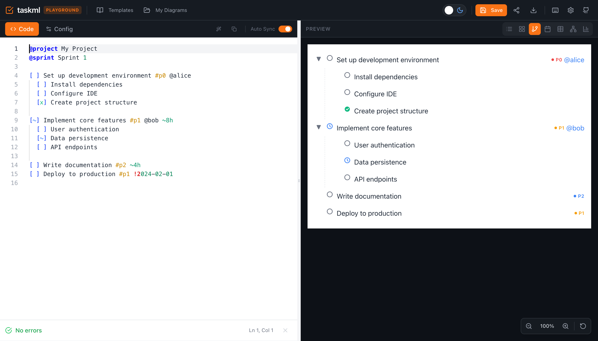
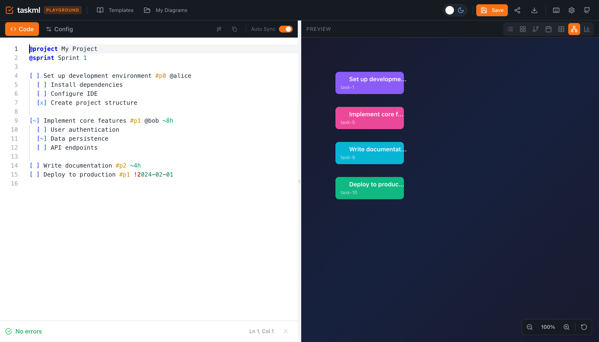

<div align="center">

# TaskML

[](https://www.npmjs.com/package/taskml)
[](https://opensource.org/licenses/MIT)
[](https://github.com/yuvalsuede/taskml/actions/workflows/ci.yml)
[](https://www.npmjs.com/package/taskml)

**The task markup language for AI agents.**

> Write tasks in plain text. Render them as beautiful visualizations.

[Website](https://taskml.dev) · [Playground](https://taskml.dev/playground) · [API Docs](./packages/core/README.md)



</div>

---

## Why TaskML?

- **Human-Readable** - Plain text that anyone can read and write
- **AI-Native** - Designed for LLM agents to generate and parse
- **Multiple Views** - List, Kanban, Timeline, Table, Tree, Graph
- **Zero Dependencies** - Lightweight ~15KB core library

---

## Quick Start

```bash
npm install taskml
```

```typescript
import { parse, render, getStyles } from 'taskml';

const taskml = `
@project Website Redesign

[x] Design homepage @alice
[~] Build API !1 @bob
  [x] Setup database
  [~] Create endpoints
[ ] Write tests
`;

const { document } = parse(taskml);
const html = render(document, { view: 'list' });
```

---

## Syntax

```taskml
@project Website Redesign    # Metadata
@sprint Q1 2025

== Design Phase ==            # Section header

[x] Create wireframes !1 @designer ~2d    # Completed, high priority
[~] Homepage mockup !0 @designer          # In progress, critical
  [x] Hero section                        # Nested subtask
  [~] Features grid
  [ ] Footer
[ ] Review designs                        # Pending

== Development ==

[!] Blocked by API @dev                   # Blocked status

- Note: Using Tailwind                    # Comment/note
```

### Task Statuses

| Syntax | Status |
|--------|--------|
| `[ ]` | Pending |
| `[~]` | In Progress |
| `[x]` | Completed |
| `[!]` | Blocked |

### Modifiers

| Syntax | Meaning |
|--------|---------|
| `!0` - `!3` | Priority (critical → low) |
| `@name` | Assignee |
| `~2d` | Time estimate |
| `#tag` | Tag |

---

## View Types

TaskML renders your tasks in multiple beautiful views:

### List View
Hierarchical task list with nested subtasks, priorities, and assignees.


### Kanban View
Columns grouped by status - Pending, In Progress, Completed.



### Timeline View
Gantt-style chart based on time estimates and due dates.



### Table View
Spreadsheet view with sortable columns for status, priority, assignee, and more.



### Tree View
Collapsible tree structure showing task hierarchy.



### Graph View
Network diagram showing task relationships and dependencies.



---

## Try It Online

**[taskml.dev/playground](https://taskml.dev/playground)** - Interactive editor with live preview

---

## Use Cases

- **AI Agent Task Management** - Let LLMs generate and track tasks
- **Project Planning** - Quick task lists without heavy tools
- **Documentation** - Embed task lists in markdown
- **Automation** - Parse and process task files programmatically

---

## Documentation

- [API Reference](./packages/core/README.md) - Full API documentation
- [Language Spec](./packages/spec) - Complete syntax specification
- [Contributing](./CONTRIBUTING.md) - How to contribute
- [Changelog](./CHANGELOG.md) - Version history

---

## Contributing

```bash
git clone https://github.com/yuvalsuede/taskml.git
cd taskml
bun install
bun run dev
```

See [CONTRIBUTING.md](./CONTRIBUTING.md) for guidelines.

---

## License

[MIT](./LICENSE) - Made by [Yuval Suede](https://github.com/yuvalsuede)
