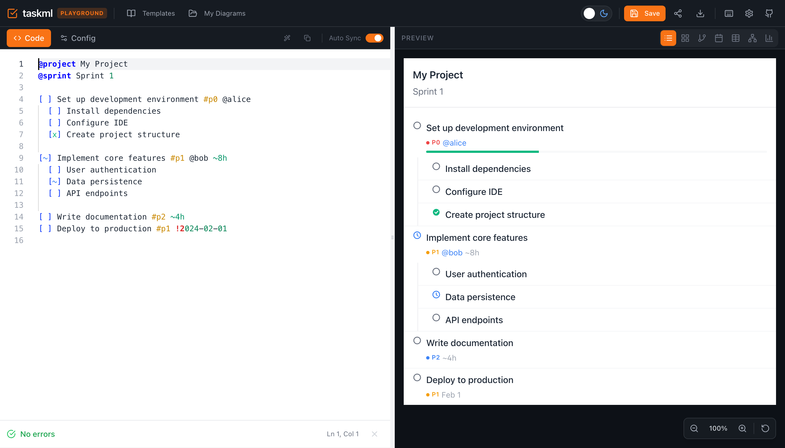
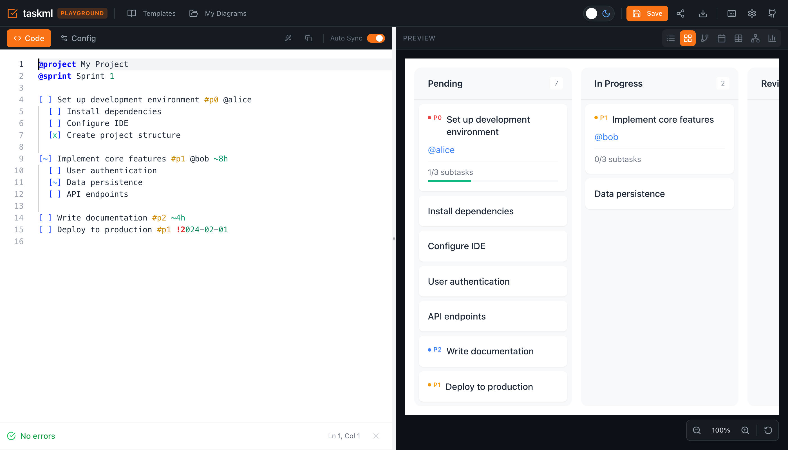
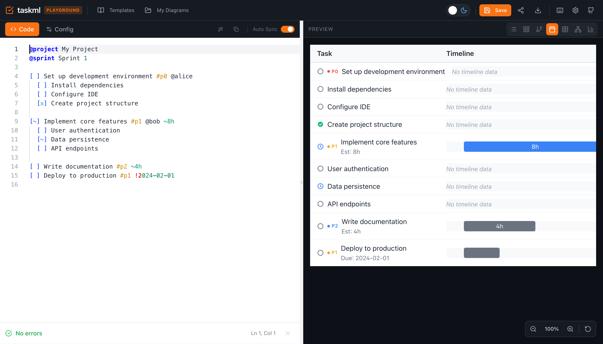
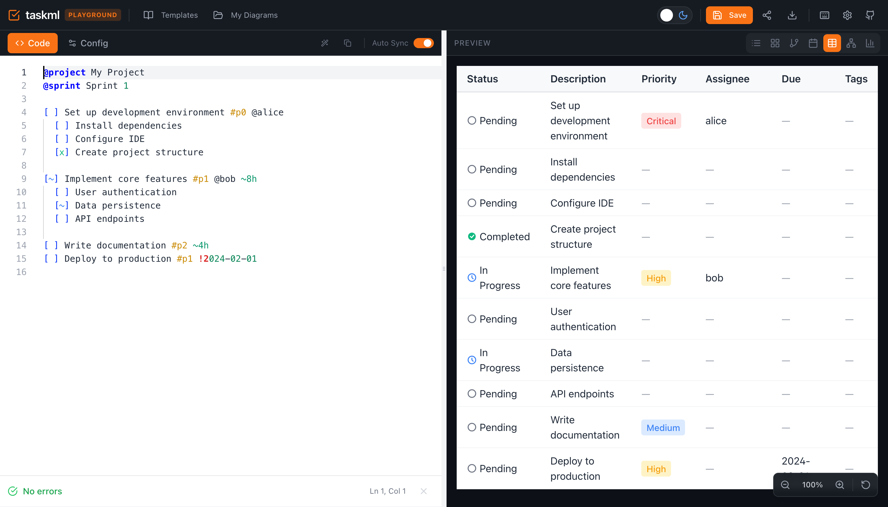
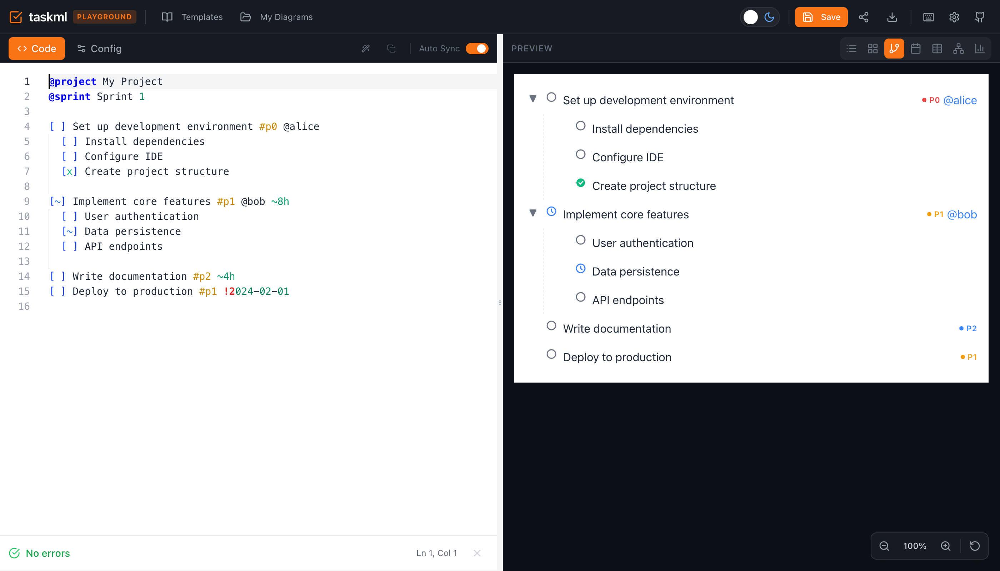
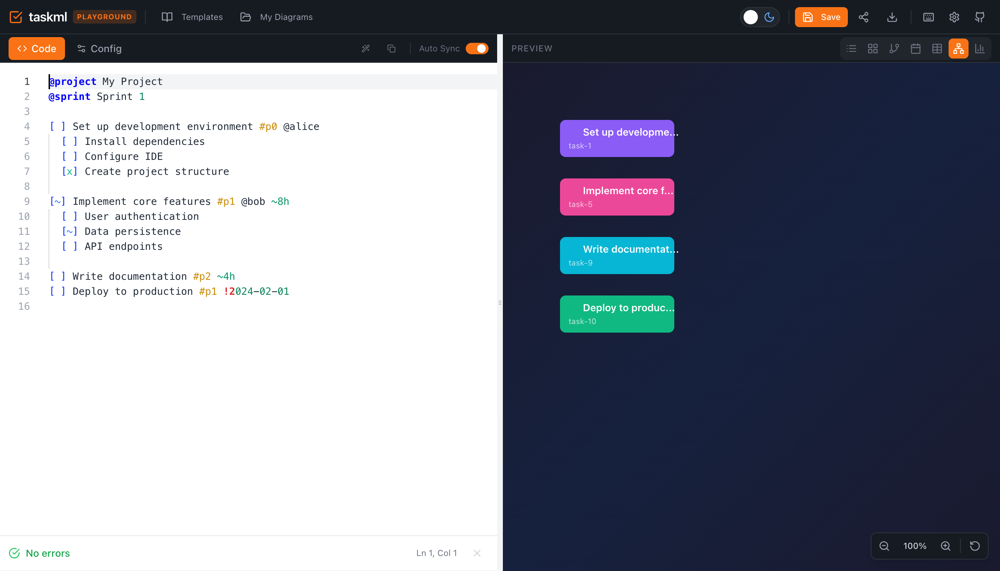
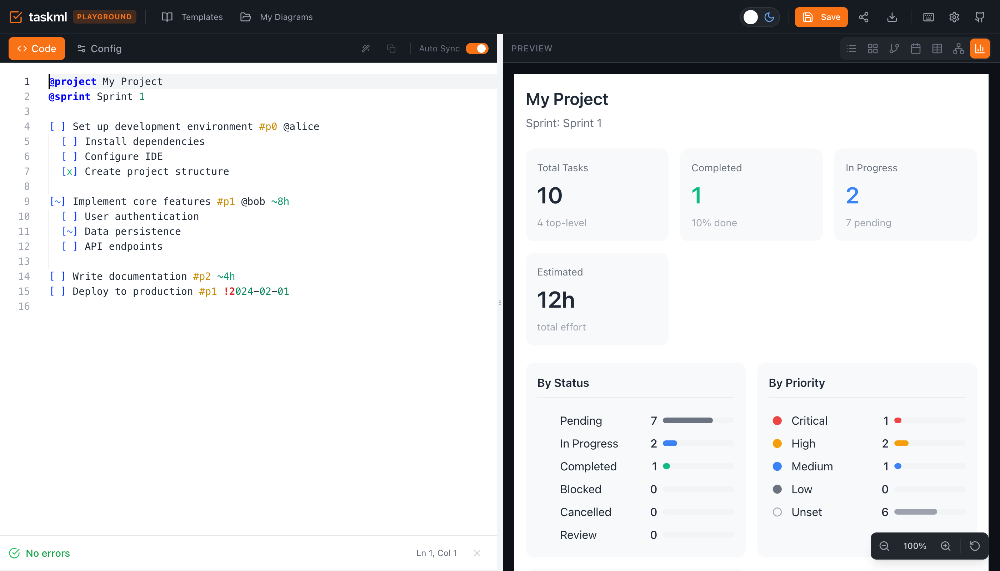

<div align="center">

# TaskML

[](https://www.npmjs.com/package/taskml)
[](https://opensource.org/licenses/MIT)
[](https://bundlephobia.com/package/taskml)
[](https://www.npmjs.com/package/taskml)

**The task markup language for AI agents.**

Simple syntax. Multiple views. Zero dependencies.

[Website](https://taskml.dev) · [Playground](https://taskml.dev/playground) · [npm](https://www.npmjs.com/package/taskml) · [GitHub](https://github.com/yuvalsuede/taskml)

</div>

---

## Table of Contents

- [Why TaskML?](#why-taskml)
- [Quick Start](#quick-start)
- [Full Protocol Specification](#full-protocol-specification)
  - [Directives](#directives)
  - [Task Syntax](#task-syntax)
  - [Task Status](#task-status)
  - [Task Metadata](#task-metadata)
  - [Subtasks & Hierarchy](#subtasks--hierarchy)
  - [Sections](#sections)
  - [Comments & Notes](#comments--notes)
  - [Verification Criteria](#verification-criteria)
  - [Dependencies](#dependencies)
- [Complete Examples](#complete-examples)
- [View Types](#view-types)
- [API Reference](#api-reference)
- [AI Integration](#ai-integration)
- [Interchange Formats](#interchange-formats)
- [Contributing](#contributing)
- [License](#license)

---

## Why TaskML?

| Feature | TaskML | Markdown | YAML | JSON |
|---------|--------|----------|------|------|
| Human-readable | ✅ | ✅ | ⚠️ | ❌ |
| Human-writable | ✅ | ✅ | ⚠️ | ❌ |
| AI-friendly | ✅ | ⚠️ | ✅ | ✅ |
| Task metadata | ✅ | ❌ | ✅ | ✅ |
| Hierarchy | ✅ | ⚠️ | ✅ | ✅ |
| Multiple views | ✅ | ❌ | ❌ | ❌ |
| Compact syntax | ✅ | ✅ | ❌ | ❌ |

---

## Quick Start

### Installation

```bash
npm install taskml
```

### Basic Usage

```typescript
import { parse, render, getStyles } from 'taskml';

const taskml = `
@project Website Redesign
@sprint Week 1

[x] Design homepage #p0 @alice
[~] Build API #p1 @bob ~8h
  [x] Setup database
  [~] Create endpoints
[ ] Write tests #p2
`;

// Parse TaskML
const { document, errors } = parse(taskml);

// Render to HTML
const html = render(document, { view: 'kanban' });

// Get CSS styles
const css = getStyles();
```

### Browser (CDN)

```html
<script src="https://unpkg.com/taskml/dist/index.browser.js"></script>
<script>
  const { parse, render, getStyles } = TaskML;

  const doc = parse('[x] My completed task').document;
  const html = render(doc, { view: 'list' });

  document.getElementById('app').innerHTML = html;
</script>
<style>${TaskML.getStyles()}</style>
```

---

## Full Protocol Specification

### Directives

Directives define document-level metadata. They start with `@` and appear at the top of the document.

```taskml
@project Project Name
@sprint Sprint Name
@team Team Name
@version 1.0
```

| Directive | Description | Example |
|-----------|-------------|---------|
| `@project` | Project name | `@project Website Redesign` |
| `@sprint` | Sprint or milestone | `@sprint Q1 2025` |
| `@team` | Team name | `@team Frontend` |
| `@version` | Document version | `@version 1.0` |
| `@author` | Author name | `@author Alice` |
| `@created` | Creation date | `@created 2025-01-15` |

### Task Syntax

Tasks are the core of TaskML. Each task starts with a status indicator in square brackets.

```taskml
[status] Task description [metadata...]
```

### Task Status

| Syntax | Status | Description |
|--------|--------|-------------|
| `[ ]` | Pending | Task not started |
| `[~]` | In Progress | Task being worked on |
| `[x]` | Completed | Task finished |
| `[!]` | Blocked | Task blocked by something |
| `[-]` | Cancelled | Task cancelled |
| `[?]` | Review | Task awaiting review |

**Examples:**

```taskml
[ ] Design landing page
[~] Implement user authentication
[x] Set up project repository
[!] Deploy to production (waiting for API)
[-] Legacy feature (no longer needed)
[?] Code review for PR #42
```

### Task Metadata

Metadata can be added inline after the task description.

| Syntax | Name | Description | Example |
|--------|------|-------------|---------|
| `#p0` - `#p3` | Priority | Task priority (0=critical, 3=low) | `#p0` |
| `@name` | Assignee | Person assigned | `@alice` |
| `~Xh` or `~Xd` | Estimate | Time estimate | `~4h`, `~2d` |
| `!YYYY-MM-DD` | Due Date | Deadline | `!2025-02-01` |
| `#tag` | Tag | Category/label | `#backend`, `#urgent` |
| `^id` | Task ID | Unique identifier | `^task-123` |

**Examples:**

```taskml
// High priority task assigned to Alice, estimated 4 hours
[ ] Implement login #p0 @alice ~4h

// Medium priority with due date and tags
[ ] Write documentation #p1 !2025-02-15 #docs #frontend

// Task with ID for dependencies
[ ] Setup database ^db-setup #p0 @bob ~2d

// Multiple tags
[ ] Security audit #p0 #security #backend #urgent @security-team
```

**Priority Levels:**

| Priority | Meaning | Color |
|----------|---------|-------|
| `#p0` | Critical | Red |
| `#p1` | High | Orange |
| `#p2` | Medium | Blue |
| `#p3` | Low | Gray |

### Subtasks & Hierarchy

Indentation (2 spaces or 1 tab) creates parent-child relationships.

```taskml
[ ] Parent task #p0
  [ ] First subtask
  [ ] Second subtask
    [ ] Nested subtask (grandchild)
    [ ] Another nested subtask
  [x] Completed subtask
```

**Deep nesting example:**

```taskml
[ ] Build user system #p0
  [ ] Authentication
    [x] Login form
    [x] Password hashing
    [~] OAuth integration
      [ ] Google
      [ ] GitHub
      [ ] Apple
  [ ] Authorization
    [ ] Role system
    [ ] Permissions
```

### Sections

Sections group related tasks with headers.

```taskml
== Section Name ==

[ ] Task in this section
[ ] Another task

== Another Section ==

[ ] Task in another section
```

**Example with sections:**

```taskml
@project E-commerce Platform
@sprint MVP Launch

== Backend ==

[x] Setup Node.js server #p0 @bob
[~] Database schema #p0 @bob ~4h
[ ] REST API endpoints #p1 @bob
[ ] Authentication middleware #p1

== Frontend ==

[~] React setup #p0 @alice
[ ] Component library #p1 @alice ~8h
[ ] State management #p2

== DevOps ==

[ ] CI/CD pipeline #p1 @charlie
[ ] Docker configuration #p2
[ ] Kubernetes setup #p3
```

### Comments & Notes

```taskml
// This is a single-line comment (ignored by parser)

[ ] Task with notes
  - This is a note attached to the task
  - Notes use dash prefix
  - They provide additional context

// Comments can appear anywhere
[ ] Another task
```

### Verification Criteria

Acceptance criteria with verification status.

```taskml
[ ] Implement user registration
  [✓] Email validation works
  [✓] Password strength check
  [○] Email confirmation sent
  [✗] Rate limiting (failed test)
```

| Syntax | Status | Meaning |
|--------|--------|---------|
| `[✓]` | Verified | Criterion passed |
| `[○]` | Pending | Not yet verified |
| `[✗]` | Failed | Criterion failed |

### Dependencies

Tasks can depend on other tasks using their IDs.

```taskml
[ ] Setup database ^db-setup #p0
[ ] Create user table ^user-table #p1
  depends-on: ^db-setup
[ ] Build user API ^user-api #p1
  depends-on: ^db-setup, ^user-table
[!] Deploy application ^deploy
  blocked-by: ^user-api
```

---

## Complete Examples

### Example 1: Sprint Planning

```taskml
@project Mobile App v2.0
@sprint Sprint 14
@team Mobile Engineering

== User Stories ==

[~] As a user, I can reset my password #p0 @alice ~4h !2025-01-20
  [x] Design reset flow
  [~] Implement email service
  [ ] Build reset form
  [○] Unit tests pass
  [○] QA sign-off

[ ] As a user, I can enable 2FA #p1 @bob ~8h !2025-01-22
  [ ] Research TOTP libraries
  [ ] Design 2FA setup flow
  [ ] Implement QR code generation
  [ ] Build verification screen

== Technical Debt ==

[ ] Refactor authentication module #p2 @alice ~4h
  - Current code is hard to maintain
  - Need to split into smaller services

[ ] Update deprecated dependencies #p3 @bob ~2h

== Bugs ==

[!] App crashes on Android 13 #p0 @charlie
  blocked-by: ^android-sdk-update
  - Affects 15% of users
  - Related to camera permissions

[~] Slow loading on first launch #p1 @alice ~4h
  [x] Profile the app
  [~] Optimize bundle size
  [ ] Implement lazy loading
```

### Example 2: Product Launch Checklist

```taskml
@project Product Hunt Launch
@version 1.0

== Pre-Launch (T-7 days) ==

[x] Create OG image banner #p0
[x] Write product description #p0
[x] Prepare maker comment #p1
[x] Create demo GIF #p0
[ ] Create gallery images #p0 ~2h
  [ ] Playground screenshot
  [ ] Kanban view
  [ ] Timeline view
  [ ] AI integration section

== Launch Day ==

[ ] Schedule for Tuesday 12:01am PT #p0 !2025-01-21
[ ] Set up PH draft listing #p0
  [ ] Add tagline
  [ ] Add description
  [ ] Upload media
  [ ] Add topics
[ ] Notify supporters #p1 !2025-01-20
  [ ] DM close contacts
  [ ] Post in Slack groups
  [ ] Tweet teaser

== Launch Execution ==

[ ] Post maker comment immediately #p0
[ ] Reply to ALL comments #p0 ~4h
[ ] Share on Twitter #p0
[ ] Cross-post to communities #p1
  [ ] Indie Hackers
  [ ] Hacker News
  [ ] Reddit r/SideProject

== Post-Launch ==

[ ] Write retrospective #p2 !2025-01-22
[ ] Follow up with users #p1
[ ] Address feature requests #p1
```

### Example 3: API Development

```taskml
@project REST API
@sprint Backend v1

== Authentication ==

[x] JWT token generation ^jwt-gen #p0 @backend
[x] Token validation middleware ^jwt-validate #p0 @backend
  depends-on: ^jwt-gen
[~] Refresh token flow ^refresh #p1 @backend ~4h
  depends-on: ^jwt-gen, ^jwt-validate
  [x] Generate refresh tokens
  [~] Store in Redis
  [ ] Implement rotation

== User Endpoints ==

[ ] POST /users ^create-user #p0 @backend ~2h
  depends-on: ^jwt-validate
  [✓] Input validation
  [✓] Password hashing
  [○] Email uniqueness check

[ ] GET /users/:id ^get-user #p1 @backend ~1h
  depends-on: ^create-user

[ ] PUT /users/:id ^update-user #p1 @backend ~2h
  depends-on: ^get-user

[ ] DELETE /users/:id ^delete-user #p2 @backend ~1h
  depends-on: ^get-user
  - Soft delete only
  - Keep audit trail

== Testing ==

[ ] Unit tests #p1 @qa ~4h
  depends-on: ^create-user, ^get-user, ^update-user
[ ] Integration tests #p1 @qa ~4h
[ ] Load testing #p2 @devops ~2h
```

### Example 4: Simple Todo List

```taskml
@project Weekend Tasks

[x] Grocery shopping
  [x] Fruits and vegetables
  [x] Bread
  [ ] Milk

[~] Clean apartment ~2h
  [x] Kitchen
  [~] Living room
  [ ] Bedroom
  [ ] Bathroom

[ ] Call mom !2025-01-19
[ ] Pay bills #p0 !2025-01-20
[ ] Read book ~1h
```

---

## View Types

TaskML renders to 7 different visualization types:

### List View
Hierarchical nested list with status indicators, priorities, and metadata.

```typescript
render(document, { view: 'list' });
```



### Kanban View
Columns organized by status: Pending, In Progress, Completed, Blocked.

```typescript
render(document, { view: 'kanban' });
```



### Timeline View
Gantt-chart style visualization based on estimates and due dates.

```typescript
render(document, { view: 'timeline' });
```



### Table View
Spreadsheet format with columns for all task properties.

```typescript
render(document, { view: 'table' });
```



### Tree View
Collapsible hierarchical tree structure.

```typescript
render(document, { view: 'tree' });
```



### Graph View
Network diagram showing task relationships.

```typescript
render(document, { view: 'graph' });
```



### Summary View
Dashboard with statistics, progress charts, and breakdown by status/priority.

```typescript
render(document, { view: 'summary' });
```



---

## API Reference

### Core Functions

#### `parse(input: string): ParseResult`

Parse TaskML string into a document.

```typescript
import { parse } from 'taskml';

const result = parse(`
  @project My Project
  [x] Completed task
  [ ] Pending task
`);

console.log(result.document);  // Document object
console.log(result.errors);    // Parse errors (if any)
```

#### `parseOrThrow(input: string): Document`

Parse TaskML and throw on errors.

```typescript
import { parseOrThrow } from 'taskml';

try {
  const doc = parseOrThrow(taskmlString);
} catch (e) {
  console.error('Invalid TaskML:', e.message);
}
```

#### `render(doc: Document, options?: RenderOptions): string`

Render document to HTML.

```typescript
import { render } from 'taskml';

const html = render(document, {
  view: 'kanban',    // View type
  theme: 'dark',     // 'light' | 'dark'
});
```

#### `getStyles(): string`

Get CSS styles for rendered output.

```typescript
import { getStyles } from 'taskml';

const css = getStyles();
document.head.innerHTML += `<style>${css}</style>`;
```

#### `validate(input: string): ParseError[]`

Validate TaskML without parsing.

```typescript
import { validate } from 'taskml';

const errors = validate(taskmlString);
if (errors.length === 0) {
  console.log('Valid TaskML!');
}
```

### Types

```typescript
interface Document {
  version: string;
  directives: Record<string, string>;
  tasks: Task[];
  sections?: Section[];
}

interface Task {
  id?: string;
  status: 'pending' | 'in_progress' | 'completed' | 'blocked' | 'cancelled' | 'review';
  description: string;
  priority?: number;      // 0-3
  estimate?: string;      // "4h", "2d"
  assignee?: string;
  tags?: string[];
  due?: string;           // ISO date
  dependsOn?: string[];
  blockedBy?: string[];
  subtasks?: Task[];
  criteria?: Criterion[];
  notes?: string[];
}

interface Section {
  name: string;
  tasks: Task[];
}

interface Criterion {
  description: string;
  status: 'pending' | 'verified' | 'failed';
}

type ViewType = 'list' | 'kanban' | 'timeline' | 'table' | 'tree' | 'graph' | 'summary';
```

---

## AI Integration

### System Prompt

Add this to any LLM's system prompt to enable TaskML output:

```
When tracking tasks, projects, or to-dos, use TaskML format:

DIRECTIVES (optional, at document start):
@project Project Name
@sprint Sprint Name

TASK SYNTAX:
[ ] Pending task
[~] In progress task
[x] Completed task
[!] Blocked task

METADATA (inline, after task text):
#p0-#p3 = priority (p0=critical, p3=low)
@name = assignee
~Xh or ~Xd = time estimate
!YYYY-MM-DD = due date
#tag = category tag

SUBTASKS (indent with 2 spaces):
[ ] Parent task
  [ ] Subtask
  [ ] Another subtask

SECTIONS:
== Section Name ==

Example:
@project Website Launch

== Design ==
[x] Wireframes #p0 @alice
[~] Mockups #p1 @alice ~4h

== Development ==
[ ] Frontend #p1 @bob ~8h !2025-02-01
[ ] Backend #p1 @charlie ~8h
```

### Example Conversations

**User:** Help me plan a product launch

**AI Response:**
```taskml
@project Product Launch
@sprint Pre-Launch

== Marketing ==
[ ] Create landing page #p0 @marketing ~4h
[ ] Write blog post #p1 @content ~2h
[ ] Social media campaign #p1 @social
  [ ] Twitter thread
  [ ] LinkedIn post
  [ ] Product Hunt listing

== Technical ==
[ ] Final QA testing #p0 @qa ~4h
[ ] Performance optimization #p1 @dev ~4h
[ ] Setup monitoring #p2 @devops ~2h

== Launch Day ==
[ ] Deploy to production #p0 @devops !2025-02-01
[ ] Send announcement email #p0 @marketing
[ ] Monitor metrics #p1 @analytics ~8h
```

---

## Interchange Formats

### JSON

```typescript
import { toJSON, fromJSON, stringifyJSON, parseJSON } from 'taskml';

// Document → JSON object
const json = toJSON(document);

// JSON object → Document
const doc = fromJSON(json);

// Document → JSON string
const jsonString = stringifyJSON(document);

// JSON string → Document
const doc = parseJSON(jsonString);
```

### YAML

```typescript
import { toYAML, fromYAML } from 'taskml';

// Document → YAML string
const yaml = toYAML(document);

// YAML string → Document
const doc = fromYAML(yaml);
```

---

## Contributing

```bash
git clone https://github.com/yuvalsuede/taskml.git
cd taskml
npm install
npm run dev
```

See [CONTRIBUTING.md](./CONTRIBUTING.md) for guidelines.

---

## License

[MIT](./LICENSE) © [Yuval Suede](https://github.com/yuvalsuede)

---

<div align="center">

**[Try the Playground →](https://taskml.dev/playground)**

</div>
